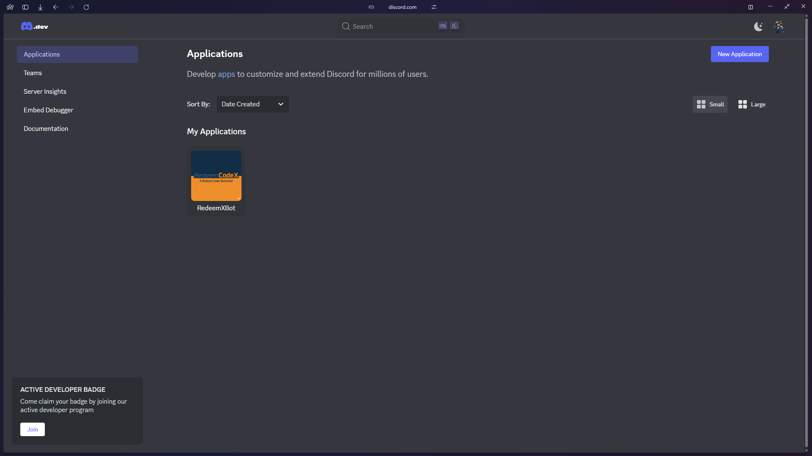
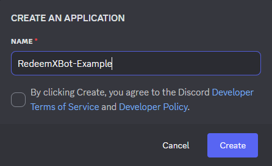
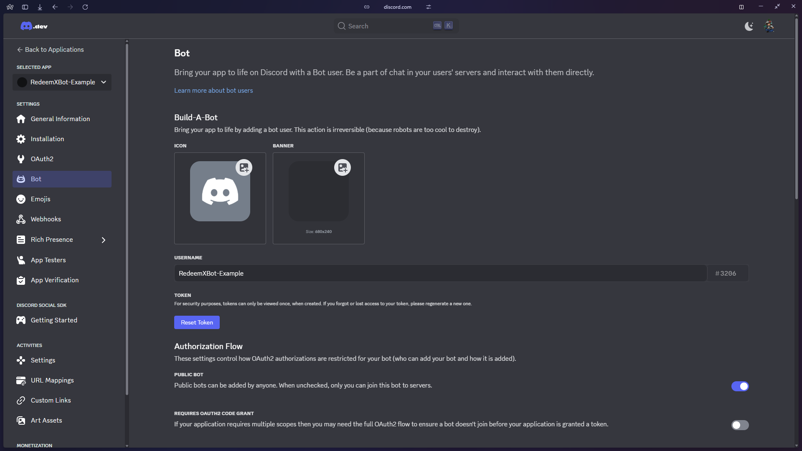
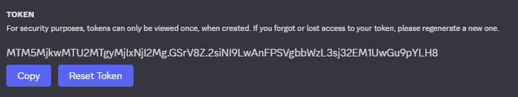
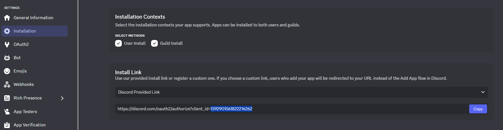
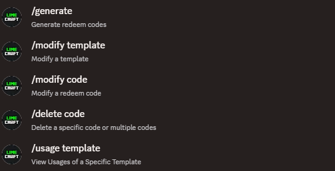

# 🤖 Discord Bot Addon

The **Discord Bot Addon** lets server admins manage and interact with RedeemCodeX **directly from Discord using slash commands** — perfect for template, code, and usage control without needing in-game or console access.

---

## 💾 Installation Guide — Discord Bot

Follow these steps to create your bot, retrieve the necessary information, and invite it to your Discord server.

---

### 📸 Step 1: Create a New Bot

1. Go to the [Discord Developer Portal](https://discord.com/developers/applications)
2. Click **“New Application”**



Give your bot a recognizable name (e.g., `RedeemCodeXBot`) and click **Create**.



---

### 🤖 Step 2: Generate Token

1. Go to the **Bot** tab on the sidebar


Now you're on the bot page:



Click **“Reset Token”** and copy the token to use in your config:



```yaml
bot:
  enabled: true
  token: "PASTE_YOUR_TOKEN_HERE"
```

!!!warning "Keep your token private"
    if leaked, regenerate it.


---

### 🆔 Step 3: Copy the Client ID

Go to the **Installation > General** tab and copy the **Client ID**.



---

### 🔗 Step 4: Invite the Bot

Use the following link format to invite your bot to your server:

```
https://discord.com/oauth2/authorize?client_id=YOUR_CLIENT_ID&permissions=2260742241024&scope=bot%20applications.commands
```

> ✅ Replace `YOUR_CLIENT_ID` with the one copied in Step 3.

This will authorize the bot with:

* Slash command access to specify role only
* No admin permissions (safe default)

```yaml
bot:
  enabled: true
  token: "YOUR_BOT_TOKEN"

  # It allows the bot to join multiple guilds, but only works with one at a time
  guilds:
    - "1327528109711830036" #Example

  # Channel IDs where the bot will respond to slash commands
  channels:
    - "1389642636531514958" #Example

  # Role IDs that have permission to use bot commands
  roles:
    - "1327892147723890698" #Example
```

> ⚠️ **Important:**
>
> * Replace `YOUR_BOT_TOKEN` with your actual bot token
> * Ensure the bot is invited with appropriate **application.commands** and **bot** scopes
> * Slash commands will only work in the listed `channels` and for users with the listed `roles`

---

## 💬 Available Slash Commands

These commands are registered automatically when the bot is authorized:



| Command            | Description                                  |
| ------------------ | -------------------------------------------- |
| `/generate`        | Generate redeem codes using a template       |
| `/modify template` | Modify properties of an existing template    |
| `/modify code`     | Edit an existing redeem code                 |
| `/delete code`     | Delete a specific code                       |
| `/usage template`  | View redemption usage of a specific template |

---

## 📦 Features

* ✅ Full control over code and template management
* ✅ Quick access for trusted staff without Minecraft login
* ✅ Secure role/channel-based permission system
* ✅ Slash commands for clean UI and ease-of-use
