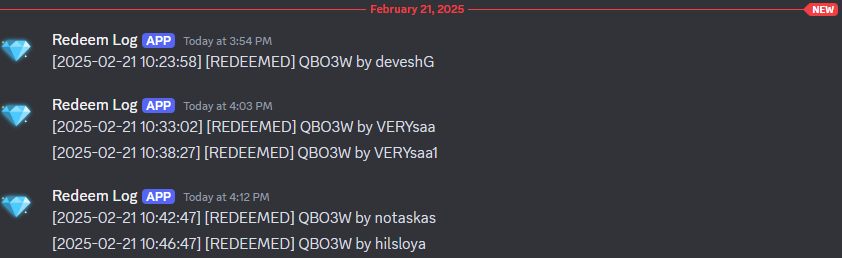

# ✨ Features of RedeemCodeX

RedeemCodeX is a complete, high-performance solution for managing redeemable codes on your Minecraft server. 
Whether you're giving away rewards, or selling perks — RedeemCodeX has everything you need.

---

## :octicons-pencil-16: Ease of Customization
- **MySQL DataBase Support**
- **Mini-Message**
- **Template Based Bulk Generation & Modification**
- **Preview Code/Template Before Distrubtion**
- **Advance Restriction** (e.g. limit, condtions, permissions etc.)
- **Command Cooldown & Code Cooldown**
- **Code Validity**
- **IP Prevention**
- **Custom Rewards, messages, sounds**
- **Discord Embeds**
- **Auto Backup**
- **[Discord Bot (addon)](../addons/discord-bot-x.md)**
- **[Get/Post API (addon)](../addons/redeem-x-rest-api.md)**

!!! tip "Use Templates to Save Time"
    Use templates to generate dozens of codes with shared properties. You can modify the template later, and all synced codes will update automatically!

---

## :octicons-sync-16: Template Syncing

With **template syncing**, you can:

* Generate bulk codes from a single template
* Modify the template once to update all codes
* Enable or disable syncing per code

!!!question "What Syncing Actually Means"
    When a code is synced, all updates to the template (e.g., rewards, messages, limits) will reflect in the synced code immediately.

---

## :material-console: Simple Commands

### Use the `/rcx` command group for full admin control:

* `/rcx gen` to generate codes or templates
* `/rcx modify` to update properties
* `/rcx delete`, `/rcx usage`, `/rcx preview`, etc.

### Players simply use:
    /redeem <code> [pin]


!!! tip "More Info"
    See the [Redeem Command](../commands/redeem.md) pages for full command breakdowns.

---

## :material-compass-outline: Usage Tracking

Track code redemptions easily:

* See how many times a code has been redeemed
* View the commands/messages of the code
* Use `/rcx usage` to view all set values

```bash
/rcx usage code <code> [property]
```

```bash
/rcx usage template <template> [property]
```

!!! Example
    All redemption data is stored safely in the plugin’s data files. You can also log redemptions externally via Discord webhook.<br><br>
    


---

!!! tip "Future Plans"
    - Redeemcode Operation directly through GUI
    - Bind Redeemcode to items
---

## 🚀 Fast Performance
* Generate thousands of code in a seconds
* Lightweight config and data I/O
* Tested on high-load environments
---
