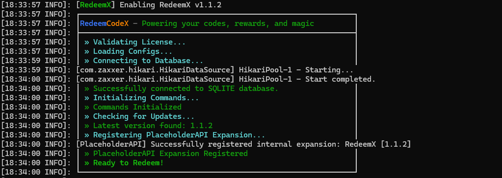

# 🧰 Installation Guide

Welcome to the RedeemCodeX installation guide. This page will walk you through installing the plugin manually.

---
!!!info " Minium Requirements"
    - Minecraft server 1.8
    - Java 8
    - Paper or Spigot server

!!!success "Recommended"
    - Minecraft server (1.21+ Recommended)
    - Java 17
    - Paper
    - [PlaceholderAPI](https://modrinth.com/mod/placeholder-api) Installed

## 📦 Download

> You can purchase the plugin from the following platforms:

* 🔗 **[BuiltByBit](https://builtbybit.com/resources/redeemcodex.68885/)**
* 🔗 **[Polymart](https://polymart.org/product/8005/redeemcodex)**

## 📁 Plugin Installation (Manual)

!!! abstract "Steps"
    1. Place the `RedeemCodeX.jar` file into your server's `/plugins/` folder.
    2. Start or restart the server.
    3. The plugin will generate its default configuration:
    
    If everything is set up correctly, you’ll see the image below indicating a successful installation.
    
    

